Hi there, I'm karminski-牙医. A coder, road bike rider, server fortune teller, electronic waste collector, co-founder of KCORES, ex-director at IllaSoft, KingsoftOffice, Juejin.

**Touch me at:**

- [🍱 Bento](https://bento.me/dr-karminski)
- [🌱 Twitter](https://twitter.com/karminski3)
- [🍦 Weibo](https://weibo.com/2169039837)
- [🍧 Zhihu](https://www.zhihu.com/people/karminski/posts)  
- [🍫 Bilibili](https://space.bilibili.com/450407615)  
- [🚲 Strava](https://www.strava.com/athletes/62277669)

**My Projects:**

- [🍭 KCORES opensource hardware repos](https://github.com/kcores)
- [🍰 KCORES A professional publication covering consumer electronics and enterprise hardware](https://kcores.com)
- [💻 cyberbus.net A professional forum focused on hardware, servers, 10G networks, storage, NAS, hacking, and related topics](https://cyberbus.net)

<!--
**karminski/karminski** is a ✨ _special_ ✨ repository because its `README.md` (this file) appears on your GitHub profile.

Here are some ideas to get you started:

- 🔭 I’m currently working on ...
- 🌱 I’m currently learning ...
- 👯 I’m looking to collaborate on ...
- 🤔 I’m looking for help with ...
- 💬 Ask me about ...
- 📫 How to reach me: ...
- 😄 Pronouns: ...
- ⚡ Fun fact: ...
-->
