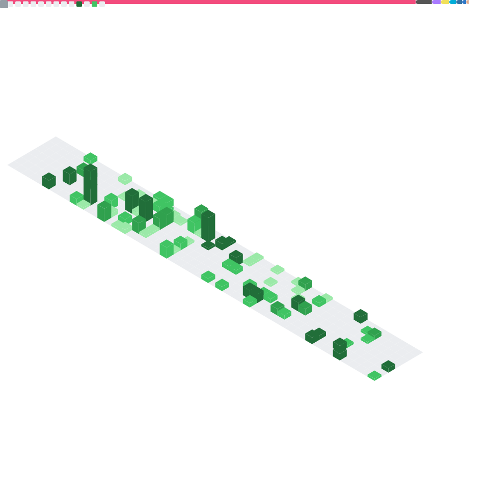

Hi there, I'm karminski-牙医. A coder, road bike rider, server fortune teller, electronic waste collector, co-founder of KCORES, ex-director at IllaSoft, KingsoftOffice, Juejin.

**Touch me at:**

- [🌱 X](https://x.com/karminski3)
- [📕 Xiaohongshu](https://www.xiaohongshu.com/user/profile/607fcaef0000000001004dcf)
- [🍦 Weibo](https://weibo.com/2169039837)
- [🍧 Zhihu](https://www.zhihu.com/people/karminski/posts)  
- [🍫 Bilibili](https://space.bilibili.com/450407615)  
- [🚲 Strava](https://www.strava.com/athletes/62277669)
- [🍱 Bento](https://bento.me/dr-karminski)

**My Projects:**

- [🍭 KCORES opensource hardware repos](https://github.com/kcores)
- [🍰 KCORES - A professional publication covering consumer electronics and enterprise hardware](https://kcores.com)
- [🍰 KCORES LLM Arena - Focus on the programming ability test of LLMs](https://llm-arena.kcores.com/)
- [💻 cyberbus.net - A professional forum focused on hardware, servers, 10G networks, storage, NAS, hacking, and related topics](https://cyberbus.net)

